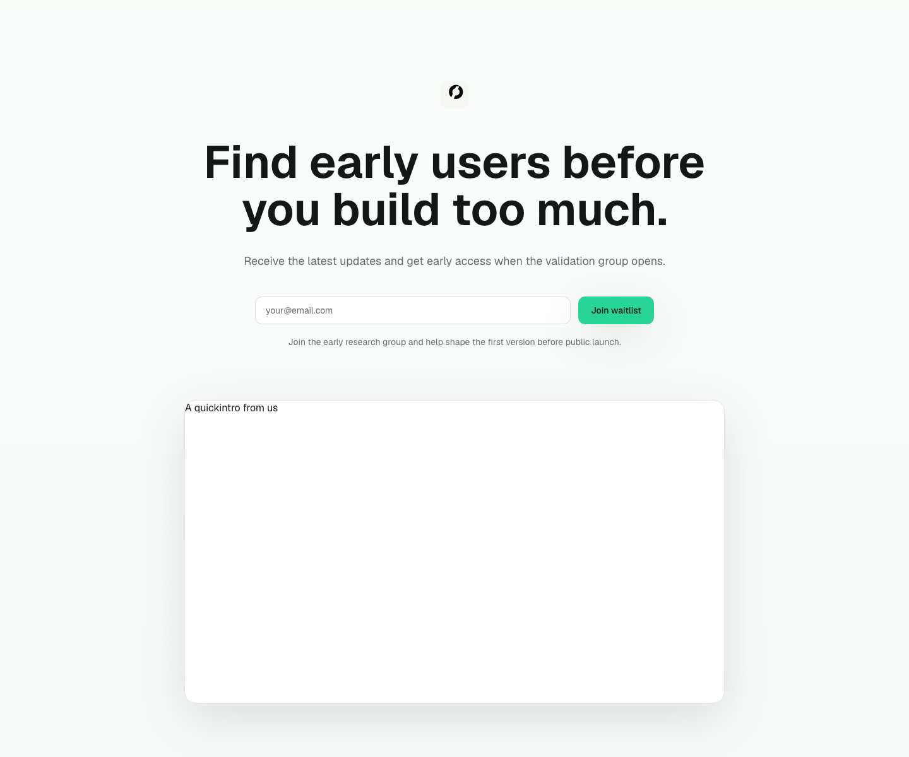
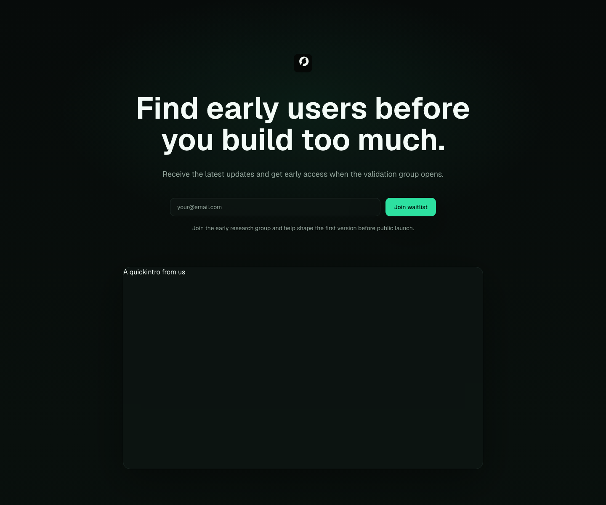
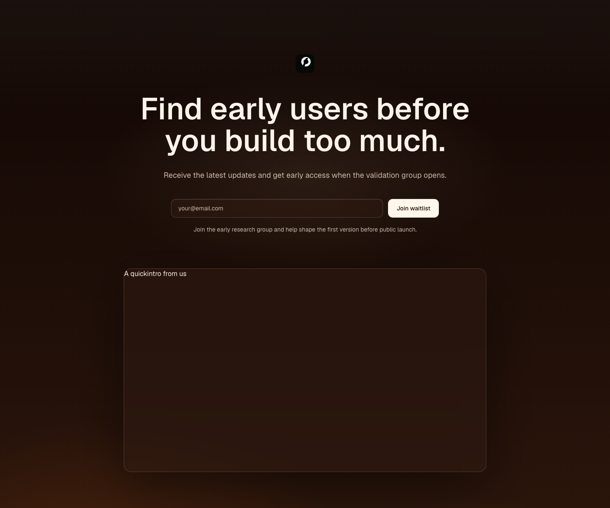
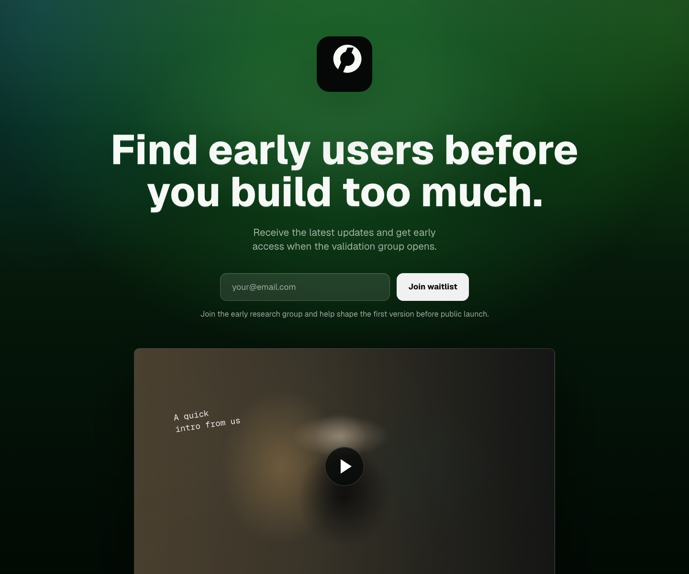
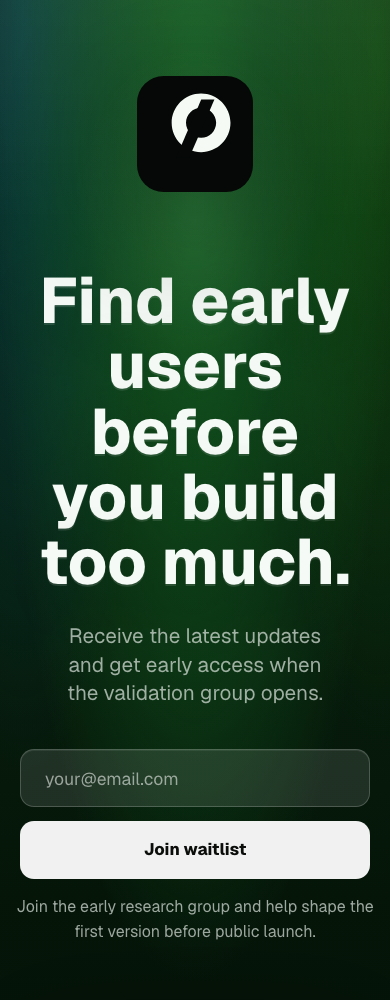
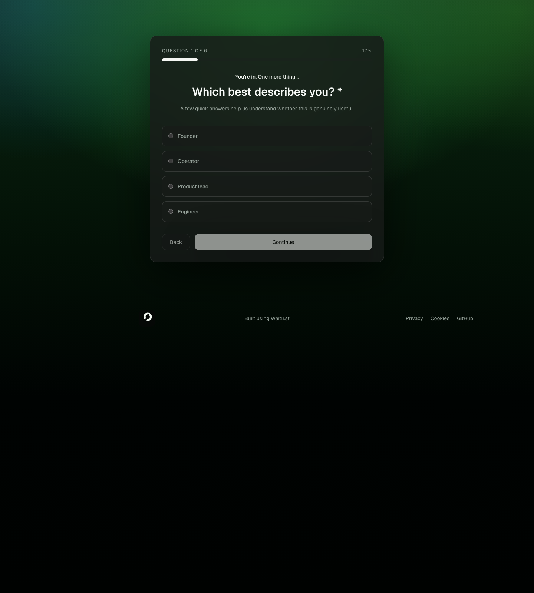
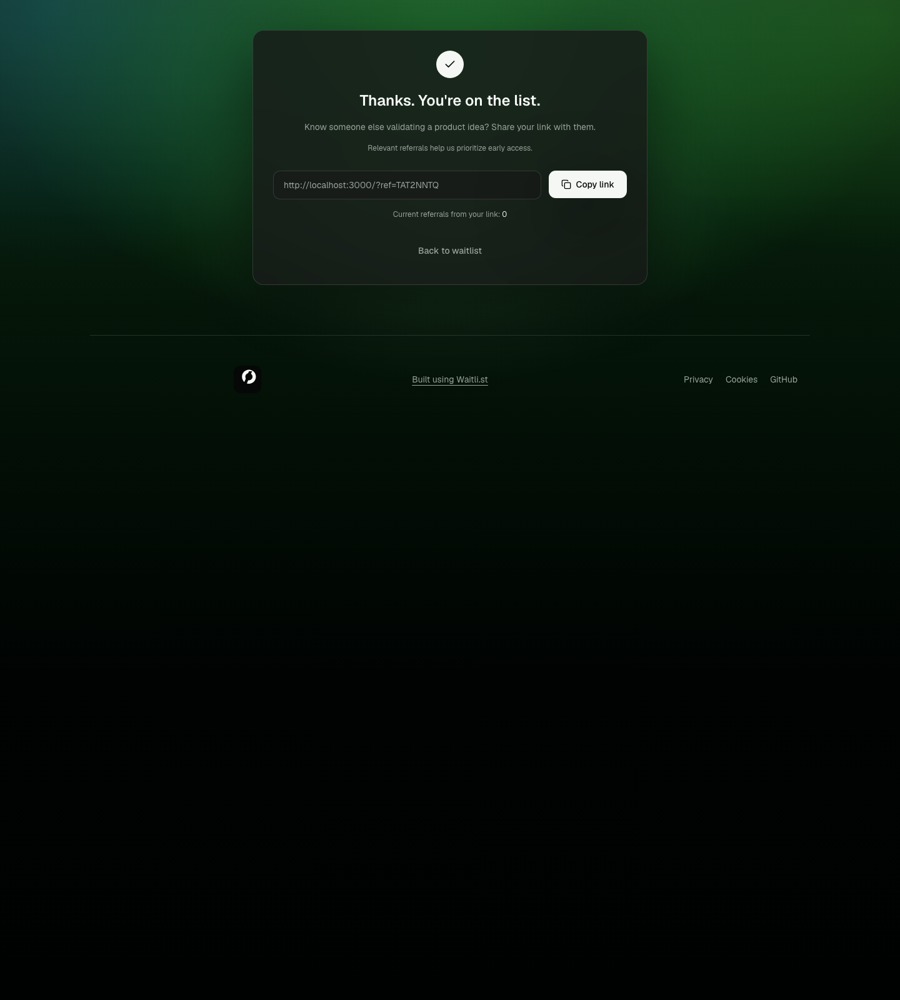

# ExitOS Waitlist Kit

A free, open-source Validation waitlist runtime for founders who need evidence before they build too much.

Most waitlist templates stop at collecting an email address. ExitOS Waitlist Kit is built for the Validate stage: capture a signup, ask a short on-site survey, preserve referral and source attribution, generate a referral link, and export the evidence for human review.

It is deliberately small. It is not a SaaS marketing site, page builder, CMS, CRM, email sequence tool, dashboard, or scoring engine.

## Screenshots

Minimal light:



Minimal dark:



Warm gradient:



Green gradient:



Mobile:



Survey:



Referral success:



## What Makes It Different

- It validates demand, not landing-page design taste.
- The page stays intentionally tiny: project mark, headline, subheadline, email capture, offer line, optional founder video, exactly three outcomes, FAQ, footer.
- The first conversion is low friction, then the survey gathers real Validation evidence.
- Every signup gets a stable referral link.
- `validationStatus` exists for manual review, but v1 does not include automatic scoring.
- Project-specific content lives in typed config, not reusable components.
- Themes can create meaningful visual variation without changing Validation logic.

## Stack

- Next.js App Router
- TypeScript
- Tailwind CSS v4
- Owned shadcn-style primitives backed by Radix UI where useful
- Lucide icons for functional UI controls
- Solar Icons for optional large content pictograms
- `next/font`
- Zod validation
- Postgres via `pg`

## Local Setup

Requires Node.js `>=20.9.0`.

```bash
git clone https://github.com/bromleyj04/exitos-waitlist.git
cd exitos-waitlist
npm install
npm run dev
```

Open `http://localhost:3000`.

With no `DATABASE_URL`, local development uses `.data/waitlist.json`. That is only for development and demos.

Run the repeatable local flow check while the dev server is running:

```bash
npm run qa:flow
```

It verifies malformed input handling, signup, duplicate email handling, survey persistence, referral attribution, analytics events, and export.

## Environment Variables

Copy `.env.example` to `.env.local`.

```bash
DATABASE_URL=
POSTGRES_SSL=true
WAITLIST_STORAGE=postgres
EXPORT_TOKEN=
```

Production deployments should use Postgres through `DATABASE_URL`. File storage is development-only and throws in production.

## Project Config

Edit:

```txt
src/config/project.config.ts
```

That one file controls:

- `name`
- `logo`
- `brand`
- `theme`
- `seo`
- `hero`
- `capture`
- `offer`
- `founderVideo`
- `reasons`
- `faq`
- `survey`
- `referral`
- `footer`

The default demo is neutral. SupaTrigger is included only as an example config:

```txt
src/config/examples/supatrigger.config.ts
```

There is no SupaTrigger-specific logic or styling inside reusable components.

## Temporary Validation Identity

Every project supports a simple mark above the hero headline and matching favicon/web icon assets.

For the full repeatable AI-agent workflow, use:

```txt
skills/temporary-validation-identity.md
```

The active project config uses:

```ts
brand: {
  name: "SignalKit",
  mark: { src: "/brand/signalkit-mark.svg", alt: "SignalKit temporary validation mark" },
  markDark: { src: "/brand/signalkit-mark-dark.svg", alt: "SignalKit temporary validation mark" },
  markLight: { src: "/brand/signalkit-mark-light.svg", alt: "SignalKit temporary validation mark" },
  favicon: "/favicon.svg"
}
```

If a project already has a logo or mark, use the supplied source assets and generate or verify the favicon/web variants. Do not redesign approved identity assets.

If a project has no identity, create one simple temporary Validation mark from the project name, positioning, ideal customer profile, and selected theme. The mark should:

- be a simple SVG geometric symbol;
- contain no text;
- work at favicon size and as the centered hero mark;
- work in monochrome;
- include light/dark variants where needed;
- avoid generic AI/startup clichés;
- use the selected waitlist theme rather than creating a full brand system.

Create one recommended mark, show it for approval, and continue. Do not run a branding workshop or generate a large concept set.

Generate favicon/web assets from the source SVG:

```bash
npm run generate:brand-assets
```

This writes `favicon.svg`, `favicon.ico`, 16/32/48px favicon PNGs, `apple-touch-icon.png`, and 192/512px web icons.

## Layout Contract

Template v1 has one layout:

- centered project mark
- large centered headline
- short centered subheadline
- email input and one CTA
- short Validation offer line
- optional large 16:9 founder video
- exactly three outcome/reason blocks
- narrow centered FAQ accordion with no heading
- minimal footer

Do not add navigation, pricing, testimonials, feature grids, fake product dashboards, repeated CTA sections, or integration strips unless they are truly required for Validation.

## Survey

Survey questions live in `src/config/project.config.ts`.

Supported question types:

- `single_line`
- `single_choice`
- `single_select`
- `radio`
- `dropdown`
- `multi_choice`
- `multi_select`
- `short_text`
- `long_text`
- `number_range`
- `scale`
- `slider`

The survey starts immediately after signup, shows one focused question per step, displays progress at the top, and completes on-site. There is no Typeform or Tally redirect by default.

## Referrals

Every person receives a stable referral code. Their share URL is:

```txt
https://your-domain.com?ref=CODE
```

The system attributes referred signups, prevents obvious self-referral where practical, counts raw referrals, and keeps raw referrals distinct from future qualified referrals. Referral `qualified` state exists in the data model, but v1 does not automatically qualify people.

## Themes

Theme presets are controlled by `theme.preset` in project config:

```ts
theme: {
  defaultMode: "dark",
  preset: "minimal-dark",
  accent: "emerald"
}
```

Included presets:

- `minimal-light`
- `minimal-dark`
- `warm-gradient`
- `green-gradient`

Preview without editing config:

```txt
/?theme=minimal-light
/?theme=minimal-dark
/?theme=warm-gradient
/?theme=green-gradient
```

Theme tokens live in `src/app/globals.css` and include:

- `--background`
- `--background-image`
- `--background-glow`
- `--foreground`
- `--muted`
- `--muted-foreground`
- `--surface`
- `--surface-tint`
- `--surface-opacity`
- `--border`
- `--primary`
- `--primary-foreground`
- `--accent`
- `--radius`
- `--shadow-soft`
- `--shadow-inner-soft`
- `--backdrop-blur`
- `--hero-weight`
- `--hero-tracking`

Tools such as PhotoGradient can be used to create static background inspiration or assets, but they are not dependencies and are not required for founder setup.

## Storage

Data model:

- `WaitlistPerson`
- `SurveyResponse`
- `Referral`
- `AnalyticsEvent`

Adapters:

- `FileStorage`: development only, writes `.data/waitlist.json`
- `PostgresStorage`: production, selected automatically when `DATABASE_URL` is present

The Postgres adapter creates the required tables if they do not exist.

Do not deploy to Vercel expecting `.data/waitlist.json` to persist. It will not.

## Analytics

The analytics boundary is intentionally small. Events are saved through the active storage adapter:

- `page_view`
- `waitlist_submit`
- `survey_started`
- `survey_completed`
- `referral_link_copied`
- `referral_signup`
- `founder_video_played`
- `followup_interest`

To add PostHog, Vercel Analytics, or another provider later, implement the `AnalyticsAdapter` interface in `src/lib/analytics/types.ts` and call it from `trackEvent`.

## Export Data

For local development JSON storage:

```bash
npm run export:data
```

This writes CSV files to `exports/`.

For deployed environments:

```bash
curl -H "Authorization: Bearer $EXPORT_TOKEN" https://your-domain.com/api/export
```

If `EXPORT_TOKEN` is unset, `/api/export` is public. Set it before using a real deployment.

## Deploy To Vercel

1. Create a Postgres database with a provider such as Neon, Supabase, Railway, Render, or Vercel-compatible Postgres.
2. Set `DATABASE_URL` in Vercel project environment variables.
3. Set `WAITLIST_STORAGE=postgres`.
4. Set `EXPORT_TOKEN`.
5. Deploy from GitHub.
6. Submit a signup, complete the survey, create a referred signup, and verify `/api/export`.

You can run the same flow check against a deployed URL:

```bash
QA_BASE_URL=https://your-domain.com EXPORT_TOKEN=your-token npm run qa:flow
```

## Create Another Theme

1. Add a preset selector to `themePresetSchema` in `src/config/schema.ts`.
2. Add semantic token values in `src/app/globals.css`.
3. Keep shared components using semantic tokens.
4. Change component recipes only if the visual treatment genuinely requires it.
5. Do not add project-specific colors directly inside shared components.

## AI-Agent Setup Prompt

```txt
Use this repository as the foundation for my project's Validation waitlist.

First interview me or inspect the provided materials to understand:
- the product idea;
- target user;
- positioning;
- Validation offer;
- three strongest reasons or outcomes;
- FAQ;
- survey questions;
- referral incentive;
- preferred theme direction.
- whether the project already has a logo or mark.

Then configure the existing boilerplate rather than redesigning it.

Use src/config/project.config.ts for project copy, brand assets, SEO, offer, reasons, FAQ, survey, referral copy, and theme preset.
Use the survey object in that same config for all survey questions.
Use theme.preset and the semantic tokens in src/app/globals.css for visual changes.

For identity, follow skills/temporary-validation-identity.md.
If the project already has a logo or mark, use the supplied assets and generate or verify the required favicon and web icon variants. Do not redesign approved identity assets.
If the project has no identity, create one simple temporary Validation mark from the product name, positioning, target user, and selected theme. It should be an SVG geometric symbol with no text, work at favicon size, work as the centered hero mark, support monochrome and light/dark usage, avoid generic AI/startup clichés, and avoid turning into a full brand system. Produce one recommended mark, show it for approval, then generate assets with npm run generate:brand-assets.

Preserve the shared waitlist components unless there is a clear Validation reason to change them:
- WaitlistHero
- EmailCapture
- FounderVideo
- ReasonGrid
- FAQAccordion
- SurveyFlow
- ReferralSuccess
- MinimalFooter

Keep the waitlist minimal: centered project mark, headline, subheadline, email capture, offer line, optional founder video, exactly three reasons, FAQ, and footer.
Do not add navigation, pricing, testimonials, dashboards, integration strips, repeated CTA sections, CMS behavior, auth, or scoring unless I explicitly ask and it is required for Validation.

Use local JSON storage only for development. For production, configure Postgres through DATABASE_URL.
After configuring, run npm run lint, npm run build, npm run qa:flow, test mobile layout, and check all theme presets.
```

## ExitOS

ExitOS is a methodology and operating system for taking business ideas through Ideate, Validate, Build, Launch, Scale, and Exit.

This repository is the reusable open-source waitlist runtime for the Validate stage. You can use it without using ExitOS, but its defaults are shaped by the principle: validate the idea, not the landing-page design.

## Icon Attribution

Lucide is used for functional interface controls. Solar Icons can be used for larger content pictograms in the Reason sections.

`@solar-icons/react` is MIT licensed. The original Solar icon set is by 480 Design and is licensed under CC BY 4.0, which allows commercial use with attribution. Keep the attribution in `NOTICE.md` or equivalent project documentation when using Solar Icons.

## License

MIT. It is permissive, simple, and suitable for founders and teams who want to clone, modify, deploy, and use the kit commercially.
